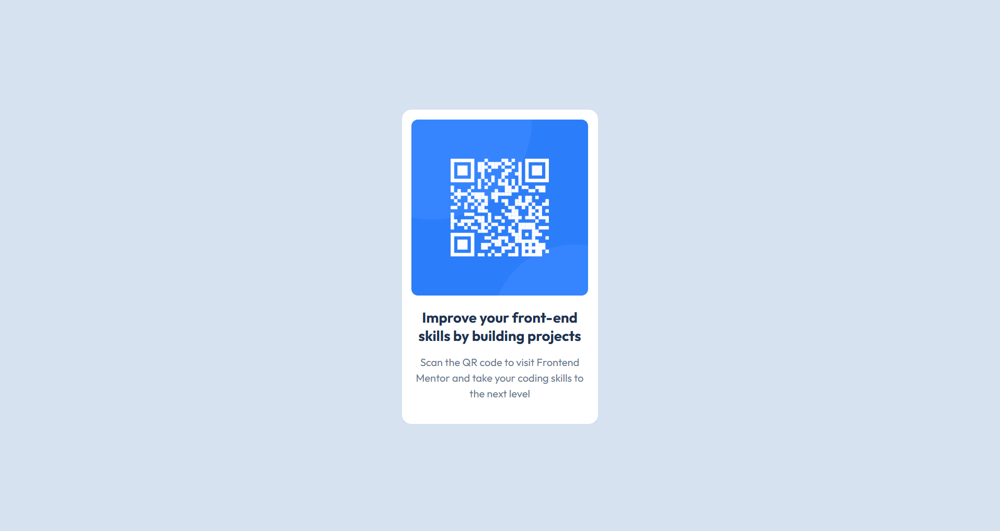

# Frontend Mentor - QR Code Component

This is my solution to the [QR Code Component challenge on Frontend Mentor](https://www.frontendmentor.io/challenges/qr-code-component-iux_sIO_H).

A simple responsive QR code component built using HTML and CSS, based on the design provided by Frontend Mentor.

## Overview

### Screenshot

### Links

* **Solution URL:**
* **Live Site URL:** Add your deployed site URL here
* **GitHub Repository:** Add your GitHub repository URL here

## My Process

### Built With

* HTML5
* CSS3
* CSS Custom Properties
* Flexbox
* Google Fonts
* Responsive design

### What I Learned

This project helped me practice building a simple component from a provided design using HTML and CSS.

I practiced:

* Structuring a webpage using semantic HTML
* Using CSS custom properties for colors
* Centering content using Flexbox
* Working with spacing, padding, and margins
* Using Google Fonts
* Creating a responsive layout for different screen sizes
* Matching a design accurately using CSS

### Continued Development

In future projects, I want to continue improving my responsive design skills and become more comfortable with writing clean, reusable CSS.

I also plan to work on more Frontend Mentor challenges with gradually increasing difficulty.

### AI Collaboration

I used ChatGPT as a learning and review tool during this project.

It was mainly used to:

* Review my HTML and CSS
* Explain CSS properties and layout behavior
* Check responsiveness on smaller screen sizes
* Suggest improvements while keeping the implementation simple

The code and design implementation were written and understood by me.

## Author

* **Frontend Mentor:** Add your Frontend Mentor profile URL
* **GitHub:** Add your GitHub profile URL
* **LinkedIn:** Add your LinkedIn profile URL

## Acknowledgments

Thanks to [Frontend Mentor](https://www.frontendmentor.io/) for providing the design and challenge.

Thanks for checking out my project!
